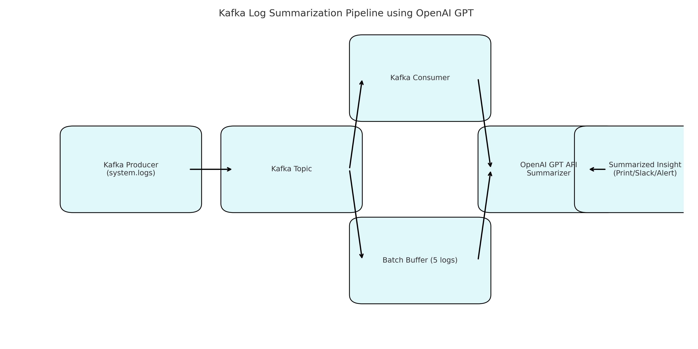

# Kafka + AI Log Summarizer

This project demonstrates how to stream system logs through Kafka and summarize them using OpenAI's GPT API. It's a lightweight, AI-assisted observability prototype—perfect for developers working with real-time pipelines.

## 🔥 Features
- Kafka Producer to simulate log events
- Kafka Consumer that:
  - Buffers logs in batches
  - Sends them to GPT-3.5 for summarization
  - Outputs a plain-English summary

## 🧠 Use Case
Great for:
- DevOps triage
- FinTech DOD monitoring
- Real-time anomaly descriptions
- Replacing noisy alerting with actual insight

## 🖼 Architecture


## ⚙️ Requirements
- Python 3.8+
- Kafka running locally (e.g., Docker)
- `openai`, `kafka-python`, `python-dotenv`

## 🚀 Quickstart

1. Clone the repo:
```bash
git clone https://github.com/yourname/kafka-gpt-summarizer.git
cd kafka-gpt-summarizer
```

2. Set up environment:
```bash
python3 -m venv venv
source venv/bin/activate
pip install -r requirements.txt
```

3. Add your OpenAI key:
Create a `.env` file:
```
OPENAI_API_KEY=your_key_here
```

4. Run Kafka locally (docker-compose or your setup)

5. Start log producer:
```bash
python kafka_producer.py
```

6. Start the consumer with GPT summarization:
```bash
python kafka_consumer_gpt.py
```

## 📈 Latency
Average GPT call latency per batch (~5 logs): **~1.0–1.2 seconds**

## 📬 Output
Summaries print to console; can be extended to Slack, email, or dashboards.

## 📎 Inspired By
That one time someone said *“Kafka is dead”*. This project disagrees.

---

© 2025 Rajan Sundaram — Built with ❤️ and sarcasm.
